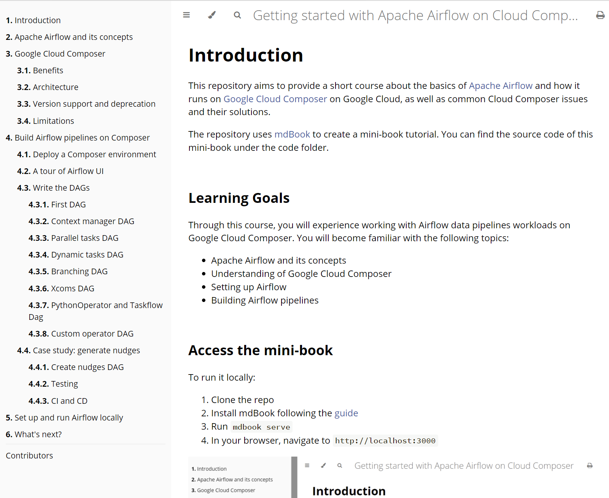

# Introduction

This repository aims to provide a short course about the basics of [Apache Airflow](https://airflow.apache.org/) and how it runs on [Google Cloud Composer](https://cloud.google.com/composer) on Google Cloud, as well as common Cloud Composer issues and their solutions.

The repository uses [mdBook](https://rust-lang.github.io/mdBook/) to create a mini-book tutorial. You can find the source code of this mini-book under the code folder.

## Learning Goals

Through this course, you will experience working with Airflow data pipelines workloads on Google Cloud Composer. You will become familiar with the following topics:

* Apache Airflow and its concepts
* Understanding of Google Cloud Composer
* Setting up Airflow
* Building Airflow pipelines

## Access the mini-book

To run it locally:

1. Clone the repo
2. Install mdBook following the [guide](https://github.com/rust-lang/mdBook#installation)
3. Run `make serve`
4. In your browser, navigate to `http://localhost:3000`

## Contribution

If you'd like to get involved, either fixing a grammar mistake or adding a new chapter, please send a pull request!

## TODO

As Composer 2.0 was released a couple of weeks ago, this course needs to add information about it soon.
