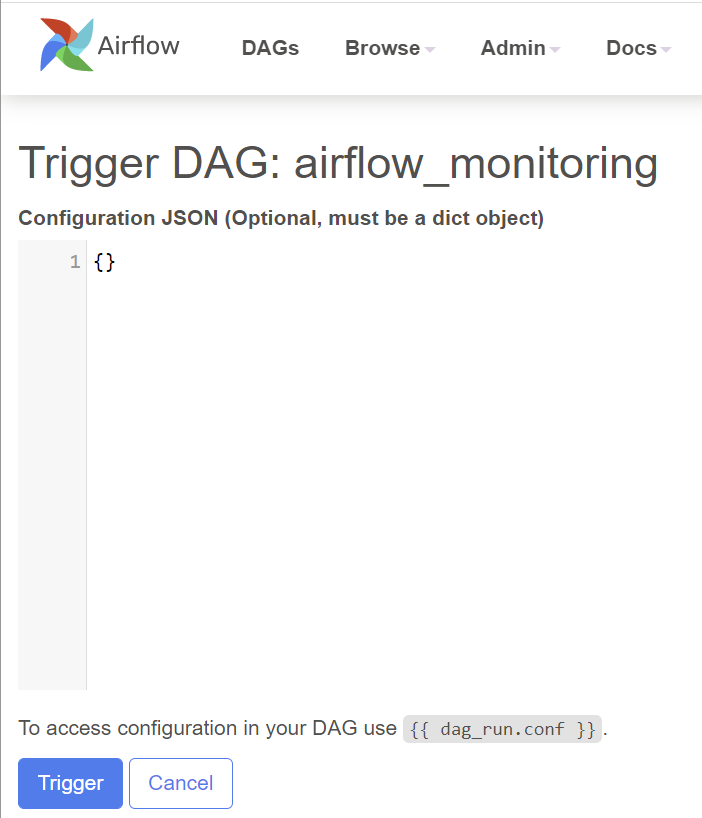
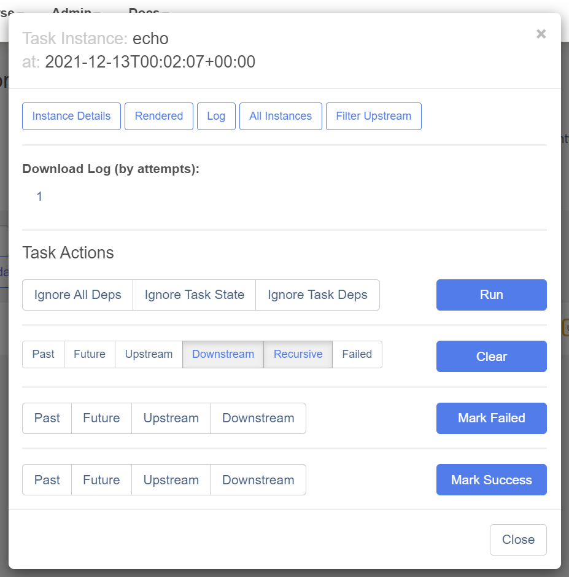
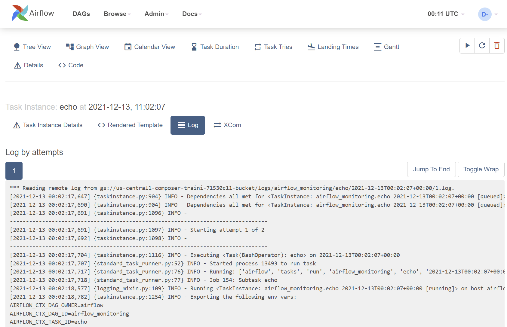
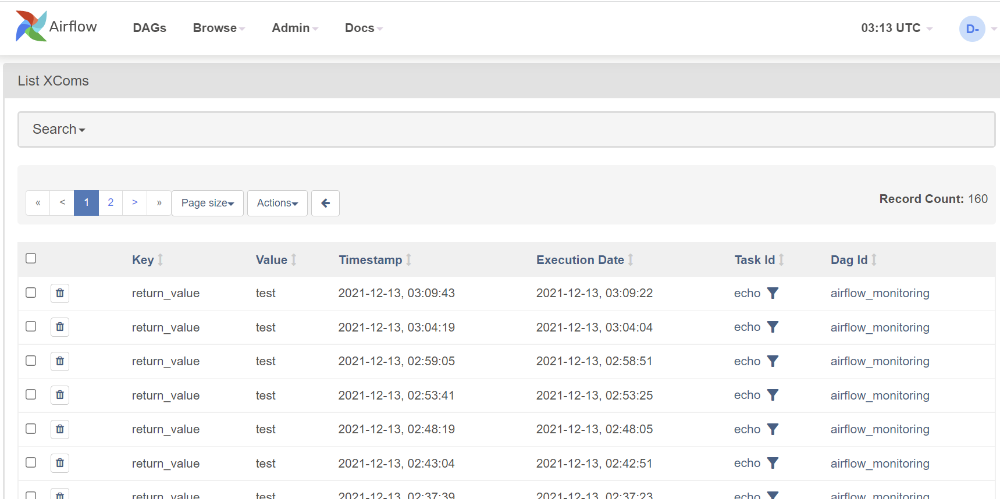

# A tour of Airflow UI

The Airflow UI makes it easy to monitor and troubleshoot your data pipelines. It can also be helpful to administer Airflow cluster, and you can view and set up Airflow’s:
- Variables
- Configurations
- Connections
- Plugins
- Pools
- XComs

Let’s take a tour of Airflow UI!

## DAGs view
The default page of Airflow UI is the DAGs view. On this view, it lists all the DAGs that are available on this Airflow instance. You can see exactly how many tasks succeeded, failed, and are currently running at a glance.

From here, you can manually trigger the DAGs by clicking the “Play” button. This can be really useful if you have a scheduled DAG that failed and you would like to re-run it.

Note that there is also an option to pass parameters(a JSON blob) when triggering dags. It creates some flexibility in running a DAG.

## Individual DAG views
After a short tour of the overall DAGs view, let’s dive into individual DAG views.

There are three kinds of individual DAG views: Tree view, Graph view, and Calendar view.

### Tree view
The tree view is the default view after clicking the DAG name on DAGs view.

A tree representation of the DAG that spans across time. You can tell each task’s status in different colors.

### Graph view
The graph view is my favorite view when I troubleshoot the issue with Airflow UI. It visualizes your DAG “s dependencies and their current status for a specific run.

By clicking the task, a pop-up shows. From the pop-up dialog, you can conduct a few actions for this specific task instance.

One of the most valuable buttons here is `Log` because it shows you the stack trace!
When a DAG fails, a typical troubleshooting process is:
1. Open Airflow UI
2. Click the failed DAG
3. Go to `Graph view` tab
4. Click the failed task(Mared in `red`)
5. On task instance pop-up dialog, click `Log` to check the logs(Stacktrace is here!)

1. If the error is due to some known issue(e.g. file didn't arrive), after fixing the issue, go back to task instance pop-up dialog, click `Clear` button. This will clear the status of the current task instance, and it will be re-run. If there are following tasks after it, they will be re-run as well.

**TODO** add a screenshot here

### Calendar view
The calendar view gives you an overview of your entire DAG's history over months, or even years. Letting you quickly see trends of the overall success/failure rate of runs overtime.

It can be pretty handy to get an idea of how stable the DAG is. For example, if your DAG is waiting for files to be landed, this can tell you if they have been late in the past X days.

## Admin pages
### Variable view
The variable view allows you to list, create, edit or delete the key-value pair of a variable used during jobs.

Value of a variable will be hidden if the key contains any words in ("password", "secret", "passwd", "authorization", "api_key", "apikey", "access_token") by default, but can be configured to show in clear-text.

It is generally NOT recommended to store any sensitive data like passwords and API keys within Airflow variables. On Google Cloud, Cloud Composer has native integration with [Google Cloud Secret Manager](https://cloud.google.com/secret-manager/docs), a detailed guide on how to use it can be found [here](https://cloud.google.com/composer/docs/secret-manager).

Airflow variables can be useful to store insensitive environment variables, for example, database connection string, API endpoints, GCS bucket name and/or path, etc.

### Configuration view
The Configuration view page displays all the Airflow configurations, including the ones in `airflow.cfg` and `Running Configuration`.

Note that default configurations in `airflow.cfg` are overwritten by the environment variables. As per [Google document](https://cloud.google.com/composer/docs/overriding-airflow-configurations), these environment variables can be set from cloud console, gcloud, API, and Terraform.

### Connection view
In the context of Airflow, a `connection` stores information such as hostname, port, login, and passwords to other systems and services. The pipeline code you will author will reference the `conn_id` of the Connection objects.

On the connection view page, connections information is shown and can be edited.

In the [last chapter](deploy-a-composer-enrionment.md), we deployed a Cloud Composer environment with a service account. In the Airflow pipelines in Composer, by default, they will use this service account to authorize all the Google Cloud API calls. This saves time setting up Google Cloud connection on Airflow configuration view page.

### XComs view
[XComs](https://airflow.apache.org/docs/apache-airflow/stable/concepts/xcoms.html) (short for "cross-communications") is a mechanism that let tasks talk to each other, as by default Tasks are entirely isolated and may be running on entirely different machines.

XComs view pages show all the values that are stored as XComs. It can be useful when troubleshooting failed DAGs that use XComs to pass the values from one task to another.

## Summary
Airflow UI can be pretty useful for:
- Data engineers to troubleshoot DAG failures
- Managers to quickly get an idea about scheduled loads
- Administrators to set up Variables and Connections. However, these are better done via deployment scripts via gcloud, API, or Terraform

That's all for the UI bit, time to write and run some DAGs!
