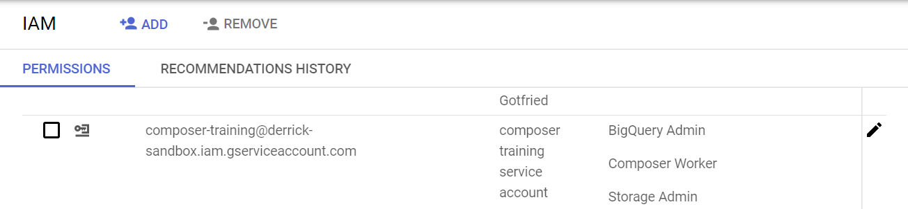
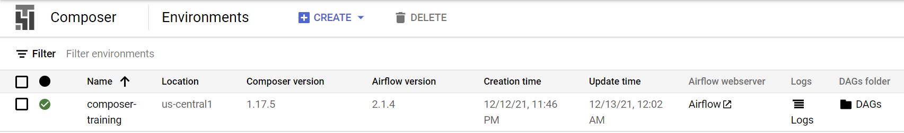
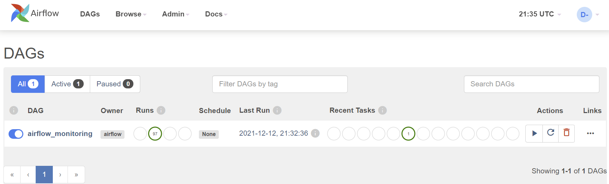

# Deploy a Composer environment

Cloud Composer can be deployed via Console, gcloud, API and Terraform. Detailed instructions can be found on Google's [document](https://cloud.google.com/composer/docs/how-to/managing/creating).

In this tutorial, we will create a public IP Composer 1(because Composer 2 is not GA yet) Airflow 2.x environment using **gcloud** cli.

_Below bash script can be found at: `code/deploy-composer.sh`_
```bash
{{#include ../code/deploy-composer.sh}}
```

Below is an example of running it in my sandbox project named `derrick-sandbox`:
```bash
PROJECT_ID=derrick-sandbox bash code/deploy-composer.sh
```

After running the deployment scripts, verify:
1. from [IAM](https://console.cloud.google.com/iam-admin) UI, a service account named `composer-training@${PROJECT_ID}.iam.gserviceaccount.com` has been created, and it has Cloud Storage and BigQuery Admin roles.

2. from [Composer](https://console.cloud.google.com/composer) UI that a Composer environment named `composer-training` has been created.

3. after clicking the link of Airflow webserver, Airflow UI is shown. Note that the Composer version we just deployed uses Airflow 2. It may look [slightly different](https://airflow.apache.org/docs/apache-airflow/1.10.15/ui.html) if you deployed an Airflow 1.x version.

