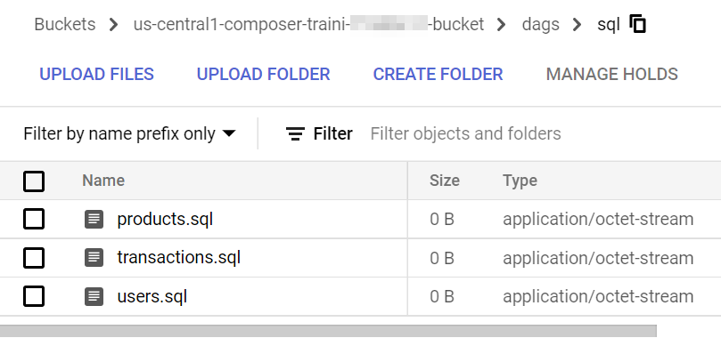
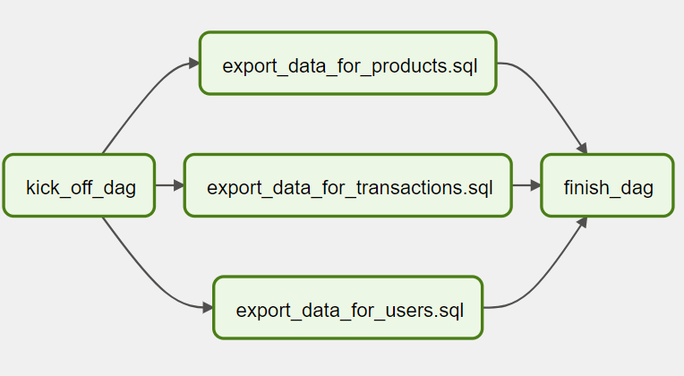

# Dynamic tasks DAG

In Airflow, a DAG is defined by Python code, there is no need for it to be purely declarative; you are free to use loops, functions, and more to define your DAG.

For example, there is a requirement to create a data pipeline to export data from tables in a database and the number of tables that need to export data is dynamic - new tables can be added anytime.

Firstly, let's put a few SQL querys in the files.



Then, let's create a DAG that uses a for loop to define some tasks. In this example, `DummyOperator` is used for demostration purpose. `DummyOperator` does literall nothing. The tasks that use it are evaluated by the scheduler but never processed by the executor.

`code/dags/4_dynamic_dag.py`
```python
{{#include ../../code/dags/4_dynamic_dag.py}}
```



Dynamic DAGs are useful, however, in general, it is recommended to try and keep the topology (the layout) of the DAG tasks relatively stable; dynamic DAGs are usually better used for dynamically loading configuration options or changing operator options.

Next, let's create a DAG to handle branching tasks.
