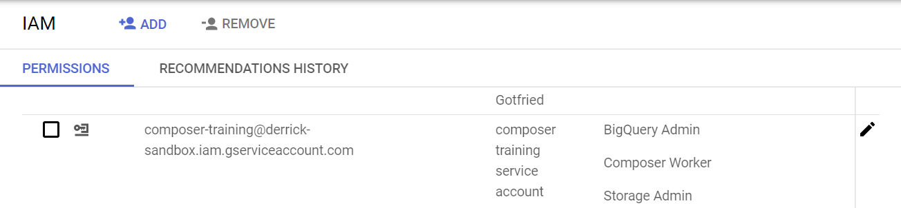
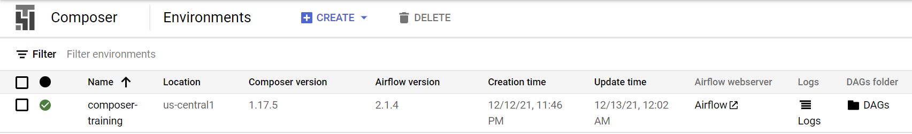
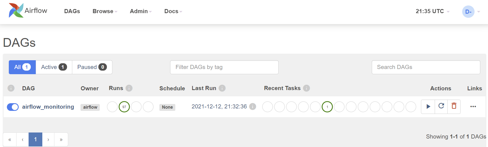

# Deploy a Composer environment

Cloud Composer can be deployed via Console, gcloud cli, API, and Terraform. You can find the detailed instructions from Google's [document](https://cloud.google.com/composer/docs/how-to/managing/creating).

In this tutorial, we will create a public IP Composer 1 (Composer 2 only recently became Generally Available) using an Airflow 2.x environment with **gcloud**.

_The bash script below can be found at: `code/deploy-composer.sh`_

```bash
{{#include ../../code/deploy-composer.sh}}
```

After running the deployment scripts, verify:

1. From [Identity and Access Management](https://console.cloud.google.com/iam-admin) (IAM) UI, a service account named `composer-training@${PROJECT_ID}.iam.gserviceaccount.com` has been created, and it has Cloud Storage and BigQuery Admin roles.

   

2. From [Composer](https://console.cloud.google.com/composer) UI that a Composer environment named `composer-training` has been created.

   

Lastly, click on the Airflow webserver to open the Airflow UI. Note that the Composer 1 environment we deployed uses Airflow 2 - the UI might look [slightly different](https://airflow.apache.org/docs/apache-airflow/1.10.15/ui.html) if you deployed an Airflow 1.x version on Composer 1.


