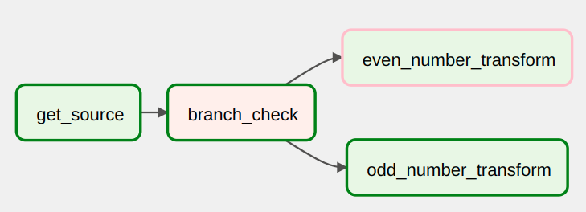
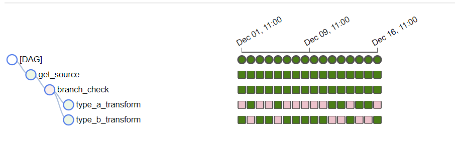

# Branching DAG

When designing data pipelines, there may be use cases that require more complex task flows than "Task A > Task B > Task C". For example, there is a use case where different tasks need to be chose to execute based on the results of an upstream task. We call this `branching` in Airflow and it uses a special operator `BranchPythonOperator` to handle this use case.

`BranchPythonOperator` takes a Python function as an input. The function must return a list of task IDs that the DAG should proceed with based on some logic.

To demostrate branching, let's create a DAG that uses Python [random.choice](https://docs.python.org/3/library/random.html#random.choice) function to decide which type of dummy transform it will execute.

`code/dags/5_branching_dag.py`
```python
{{#include ../../../code/dags/5_branching_dag.py}}
```



From the historical runs, we can see that different transform tasks were run.


