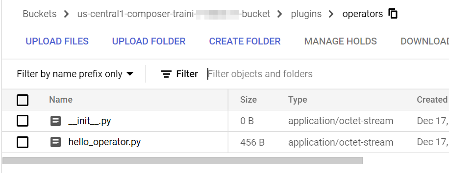
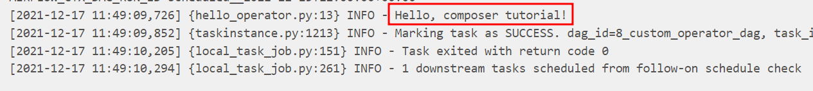

# Custom operator DAG

One thing that makes Airflow so popular is its built-in modules. There are built-in modules connecting to three major public cloud providers, as well as popular services and tools. When writing Airflow pipelines, it is always recommended to use built-in modules whenever they are available.

However, there are occasions when built-in modules cannot fulfill the requirements. Fortunately, Airflow has a plugin manager built-in that can integrate external features to its core by dropping files in your `$AIRFLOW_HOME/plugins` folder.

In this chapter, we will create a basic DAG that uses a custom Operator.

Firstly, let's create a `HelloOperator`. It inherits the `BaseOperator` and overrides the `execute` method. It also takes a parameter called `operator_param`.

Create a file named `hello_operator.py` that contains the following code:

```python
{{#include ../../../code/plugins/operators/hello_operator.py}}
```

Then we can create a DAG that uses the custom operator `HelloOperator`.

Create a file named `8_custom_operator_dag.py` that contains the following code:

```python
{{#include ../../../code/dags/8_custom_operator_dag.py}}
```

To run this DAG in Cloud Composer, the custom Operator file needs to be uploaded to the `$AIRFLOW_HOME/plugins` folder. In the context of Cloud Composer, it is the `plugins` folder under the Cloud Storage bucket.



Finally, we can run the DAG. From the log, we can see that it successfully logs the information.


