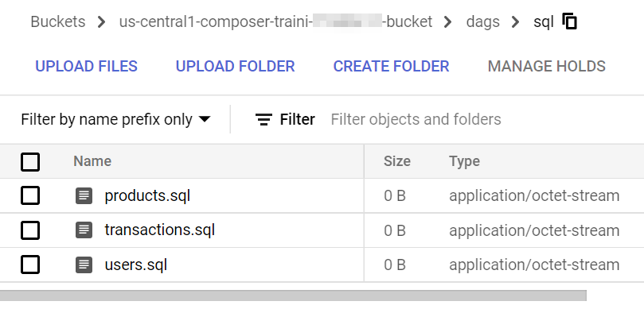
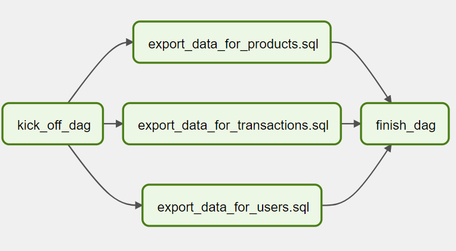

# Dynamic tasks DAG

As mentioned before, in Airflow, a DAG is defined by Python code. There is no need for it to be purely declarative; you are free to use loops, functions, and more to define your DAG.

For example, let's say that there is a requirement to create a data pipeline to export data from tables in a database. Since new tables can be added at any time, the number of tables that we need to export data from is dynamic.

Firstly, we save and upload a few SQL queries in the Cloud Storage bucket.



Then, we can create a DAG that uses a for loop to define some tasks. In this example, `DummyOperator` is used for demonstration purpose. As per name, `DummyOperator` does nothing. The tasks that use it are evaluated by the scheduler but never processed by the executor.

Create a file named `4_dynamic_dag.py` that contains the following code:

```python
{{#include ../../../code/dags/4_dynamic_dag.py}}
```



Dynamic DAGs are useful. However, try and keep the topology (the layout) of the DAG tasks relatively stable; dynamic DAGs are usually better used for dynamically loading configuration options or changing operator options.

Remember that readability is also important in designing Airflow DAGs.

Next, let's create a DAG to handle branching tasks.
