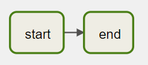

# First DAG

Let's start with a basic DAG with two tasks: `start` and `finish`.

Let's assume this DAG runs at 03:00 daily. Both of the tasks in the DAG use `BashOperator` to run a single command.

By following the five steps from the previous page, the DAG definition looks like the below:

Create a file named `1_first_dag.py` that contains the following code:

```python
{{#include ../../../code/dags/1_first_dag.py}}
```



Note that we created a DAG object in this DAG, then associated it with every task in the pipeline. The DAG code can be verbose if you have many tasks in the pipeline.

To simplify it, Airflow provides another to define the DAG using [context managers](https://docs.python.org/3/reference/datamodel.html#with-statement-context-managers). Let's see how it works.
