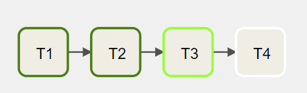
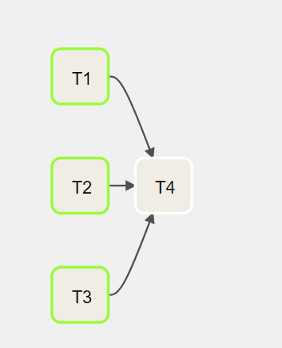

# Parallel tasks DAG

Let's assume that there are four tasks, T1, T2, T3, and T4, each one of them will take 10 seconds to run. Task T1, T2, T3 don't depend on others, while T4 depends on the success of T1, T2, and T3.

In an orchestration system that does not support parallel tasks, these tasks run sequentially one after another. It should take around 40 seconds to finish.



However, by design, Airflow supports concurrency, meaning that the tasks that don't depend on others can run in parallel.

The above DAG can be updated, and it should take ~20 seconds to finish.



The code of the DAG looks like this:

Create a file named `3_parallel_tasks_dag.py` that contains the following code:

```python
{{#include ../../../code/dags/3_parallel_tasks_dag.py}}
```
