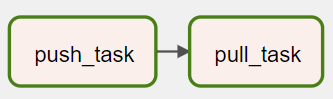
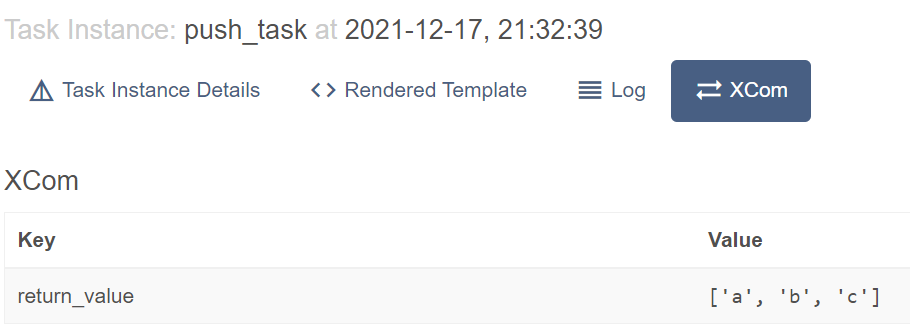
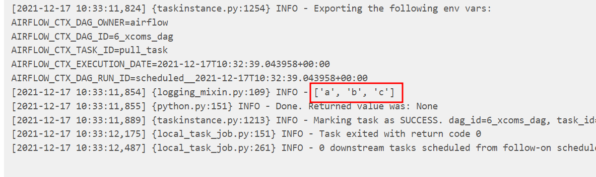

# Xcoms DAG

Sharing data between tasks is a common use case in Airflow. For example, a task calls an API to get the data file names for today's data ingestion DAG. The following tasks need to know these file names to load the data.

XCom (short for cross-communication) is a native feature within Airflow. XComs allow tasks to exchange task metadata or small amounts of data. XComs can be "pushed" (sent) or "pulled" (received). When a task pushes an XCom, it makes it generally available to other tasks.

Let's create a DAG to exchange value between tasks.

`code/dags/6_xcoms_dag.py`
```python
{{#include ../../../code/dags/6_xcoms_dag.py}}
```



From Airflow UI, there is a tab next to `Log` called XCom that shows XCom values.



Let's check the `pull_task`. Yes, the value was received!


XCom values are stored in Airflow database and are shown on UI or logs. It is important not to store sensitive information and large data in them.
