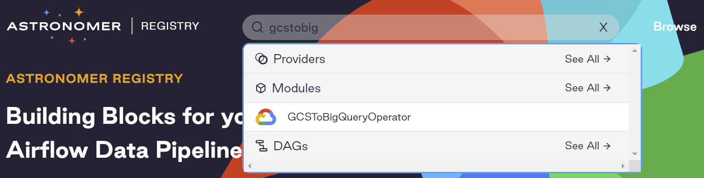
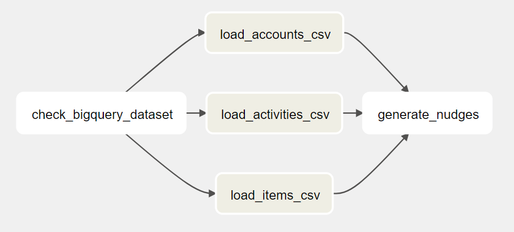
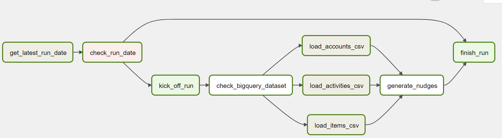

# Create nudges DAG
When designing a DAG, we often start with critical tasks such as loading the data, transformation, exporting the data, etc. Then iteratively, we add other tasks such as checking if the BigQuery Dataset exists or not, if today's load has happened, etc.

## Key tasks

To generate the nudges for the customers, we can load the daily exported CSV files to three tables in BigQuery. After that, we can run a SQL query that joins the three tables, create the nudge information, and store the results in another table.
The DAG looks like this:


As the CSV files are on GCS and we need to load them to BigQuery, we need an Operator that can do GCS to BigQuery. Because building a custom Operator, GCS to BigQuery is a pretty generic job, let's search in [Astronomer Registry](https://registry.astronomer.io/) to see if Airflow has it in the built-in libraries.

Yay, there it is! From it's [document](https://registry.astronomer.io/providers/google/modules/gcstobigqueryoperator/#example-dags), let's create our three data load tasks:

`code/dags/9_generate_nudges_dag.py`
```python
{{#include ../../code/dags/9_generate_nudges_dag.py:66:103}}
```

For the `generate_nudges` task, it runs a BigQuery query and saves the results in a BigQuery table. This may look like an ordinary job. However, there isn't an existing Operator that does the job. Therefore we need to create a custom Operator. In this custom Operator, we can use the built-in `BigQueryHook` to interact with BigQuery. We can find its source code on [GitHub](https://github.com/apache/airflow/blob/main/airflow/providers/google/cloud/hooks/bigquery.py#L66).

Let's call the custom Operator `GenerateNudgesOperator`

`code/plugins/operators/generate_nudges_operator.py`
```python
{{#include ../../code/plugins/operators/generate_nudges_operator.py}}
```

And the task looks like this:
`code/dags/9_generate_nudges_dag.py`
```python
{{#include ../../code/dags/9_generate_nudges_dag.py:105:109}}
```

## Add other tasks

### Check BigQuery Dataset
As a safety measure, we should add a task to check if the BigQuery Dataset exists before loading the CSV files.

Surprisingly, there isn't a built-in Operator; let's create another custom Operator called `CheckBigQueryDatasetOperator`. Because it needs to access BigQuery, we can use the `BigQueryHook` again.

`code/plugins/operators/check_bigquery_dataset_operator.py`
```python
{{#include ../../code/plugins/operators/check_bigquery_dataset_operator.py}}
```

And the task looks like this:
`code/dags/9_generate_nudges_dag.py`
```python
{{#include ../../code/dags/9_generate_nudges_dag.py:61:64}}
```

Now the DAG looks like this:


### Avoid duplicated runs
It is always a good idea to check if today's run finishes. There are multiple ways to do that. If there are multiple data pipelines, an API can be built to record their runs. When a pipeline is kicked off, it checks if the run for that day has been finished by calling the API. If yes, this particular DAG run should not continue with the following tasks.

In our case study, as we only have one data pipeline, we can assume that, everyday when the email system sends the emails out, it also uploads a file to GCS with the file name being the date of the day. With this design, a few tasks can be added to finalize the DAG.



Let's dig into the new tasks.

#### Get latest run date
As mentioned from the above, we can check if a file named as current date exists in the GCS bucket. To do this, we can use the `GCSListObjectsOperator` from Airflow built-in libraries. The task looks like this:

`code/dags/9_generate_nudges_dag.py`
```python
{{#include ../../code/dags/9_generate_nudges_dag.py:48:52}}
```

From the [code](https://github.com/apache/airflow/blob/main/airflow/providers/google/cloud/operators/gcs.py#L279) on Github, it returns the URI of the file on GCS or empty array(if the file does not exist). In Airflow Operator, any value that is returned by `execute` function is stored in `xcom`.

Now we have a value in `xcom`, let's move on to the next task.

#### Check run date
In this task, we can use `BranchPythonOperator` to decide if this particular run should continue. The task looks like this:

`code/dags/9_generate_nudges_dag.py`
```python
{{#include ../../code/dags/9_generate_nudges_dag.py:54:56}}
```

And the `branch_func`:
```python
{{#include ../../code/dags/9_generate_nudges_dag.py:29:37}}
```

From here, Airflow will decide if the DAG run should continue loading data or just finish. To make the pipeline more user-friendly, we can use two `DummyOperator` to represent ` kick_off_run` and `finish_run` tasks.
```python
{{#include ../../code/dags/9_generate_nudges_dag.py:58:59}}
```

## Summary
In this chapter, we've walked through how to design and create a DAG to load data from three CSV files and generate nudges in BigQuery. If you'd like to run it, you can run it yourself, be sure to replace the project ID and buckets in the DAG file.
```python
{{#include ../../code/dags/9_generate_nudges_dag.py:18:20}}
```
Or you can wait til the next chapter in which I will cover the testing strategy including a quick end-to-end test that can generate test files and trigger the DAG.
